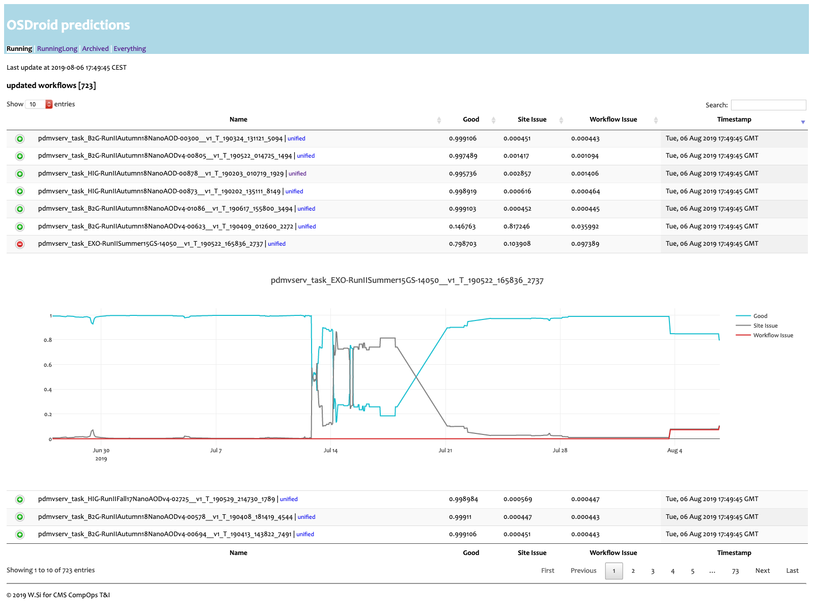

# OSDroid

Predict running workflows' actions. Currently running at vocms0116.

> Project under CMS CompOps T&I



## How to run

After environments set up and necessary configuration pieces added,

```bash
./startMonit.sh # this starts monitoring in the background
cd web/
./quickStart.sh # this starts Flask basic server on port 8020 (subject to change)
```

## Configurations etc.

A few more configuration files are needed to get it rolling.

1. `config/config.yml` for connections to UNIFIED DB, MySQL DB and alert email sending.

   ```yml
   oracle:
     - *** # username
     - *** # password
     - *** # db name

   mysql:
     - *** # username
     - *** # password
     - *** # db name

   alert_recipients:
     - XXX@YYYY.ZZ
   ```

2. `config/credential.yml` for `stompAMQ` to produce docs and authentication.

   ```yml
   producer: toolsandint-workflows-collector
   topic: /topic/cms.toolsandint.workflowsinfo
   cert: PATH_TO_CERT_FILE (***.pem)
   key: PATH_TO_KEY_FILE (***.rsa)
   hostport:
     host: XXXX.cern.ch
     port: XXXXX
   ```

3. `models/xgb_optimized.model` for running workflow inference.

4. `OSDroidDB` is the local MySQL database storing workflow prediction history, labels and short-term document archive.
   Three tables need to be created for each.

   **PredictionHistory**
   ```sql
   CREATE TABLE IF NOT EXISTS OSDroidDB.PredictionHistory (
     hid BIGINT NOT NULL AUTO_INCREMENT PRIMARY KEY,
     name VARCHAR(255) NOT NULL,
     good FLOAT,
     acdc FLOAT,
     resubmit FLOAT,
     timestamp TIMESTAMP
   );
   ```

   **LabelArchive**
   ```sql
   CREATE TABLE IF NOT EXISTS OSDroidDB.LabelArchive (
     name VARCHAR(255) NOT NULL PRIMARY KEY,
     label INT
   );
   ```

   **DocsOneMonthArchive**
   ```sql
   CREATE TABLE IF NOT EXISTS OSDroidDB.DocsOneMonthArchive (
     id INT NOT NULL AUTO_INCREMENT PRIMARY KEY,
     name VARCHAR(255) NOT NULL,
     document LONGTEXT,
     timestamp TIMESTAMP DEFAULT CURRENT_TIMESTAMP
   );
   ```

---

### Data source

- UNIFIED DB
- wmstats server
- couchdb/acdc server
- [ReqMgr2](https://github.com/dmwm/WMCore/wiki/reqmgr2-apis)

### Data storage

- [`stompAMQ`](https://github.com/jasonrbriggs/stomp.py) (wrapped in [`CMSMonitoring`](https://github.com/dmwm/CMSMonitoring)) -> HDFS /CERN MONIT infrastructure

### Model training

- [pyspark](https://github.com/apache/spark/tree/master/python) (data fetch)
- [SWAN](https://swan.cern.ch/)
- [XGBoost](https://github.com/dmlc/xgboost)

### Web SPA

- [Flask](https://github.com/pallets/flask)
- [dataTables.js](https://github.com/DataTables/DataTables)
- [plotly.js](https://github.com/plotly/plotly.js/)
